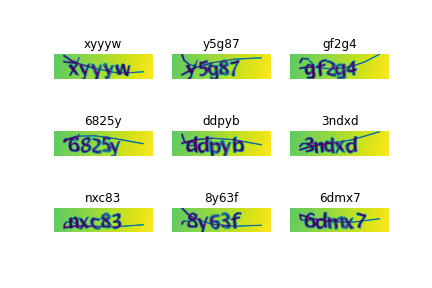

# Captcha-OCR
## explanation:
The code is using deep learning model to identify characters in captcha dataset.
Sample dataset image: 

## Dataset:
The dataset is available here:
https://github.com/shahryarfp/Captcha-OCR/blob/main/samples.zip

it should be extracted and be in the same directory as the .py file

## How to use:
Run the .py file

## Results:
Best result was 100% accuracy for the test data. 
Results will be saved in the folder "sample output"

## Reference:
https://keras.io/examples/vision/captcha_ocr/
